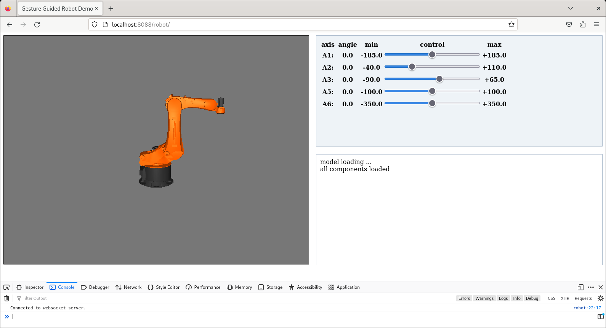

# web-robot
A web-based robot control project powered by ROS. It allows users to control the robot via a browser interface or perform operations using gesture recognition.

## Environment
- ROS Noetic
```
sudo apt install ros-noetic-desktop-full
sudo apt-get install ros-noetic-rosbridge-server
``` 
- Anaconda env with mediapipe 0.9.3.0
- Apache HTTP Server
```
sudo apt install apache2
```
This project utilizes the following libraries:

*   **three.js (including OBJLoader.js)**
*   **roslib.js**
*   **EventEmitter.js**

## Quick Start
**1. Launch rosbridge server**

It listens on port 9090 by default.
```
source catkin_ws/devel/setup.bash
roslaunch rosbridge_server rosbridge_websocket.launch
```

**2. Open the website**

URL: http://localhost:8088/robot/
<p align = "left">

</p>

**3. Launch the teleop_gesture node**

```
source catkin_ws/devel/setup.bash
rosrun web_robot teleop_gesture.py
```

## License
This project is licensed under the Mozilla Public License 2.0 (MPL-2.0).
